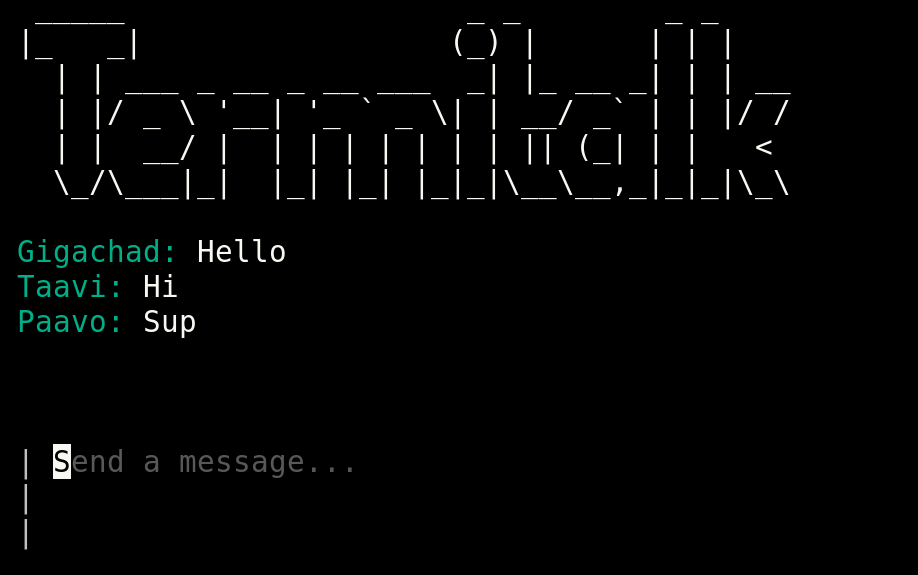

# CLI Chat application in Go

A chat application in Go, where your terminal serves as the interface! The project is mainly for fun and learning. It's also a work in progress.

## Implemented

- Bubbletea frontend UI base (Used the example from their github for starting the project out, so I can test my backend which I am focusing on first. I'm planning to customize the UI a lot later on)
- Basic websocket server
- Some basic functionality implemented:
  - Messages of the connected clients are rendered into the UI

## Working on (Core functionalities):

- User login
- Protobuf message objects. Currently only the message is sent as a string and the server gets no other data. The client generates a random username when the message is rendered.
- Multiple chat instances

## Planned features:

- 1-to-1 messaging
- group chats
- Code blocks and an easy way to copy them from the chat

## Tech stack:

- Go for frontend and backend
- Charmbracelet/bubbletea CLI frontend
- Websockets + Protobuf communication

